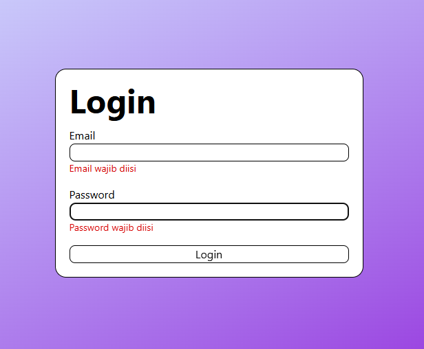
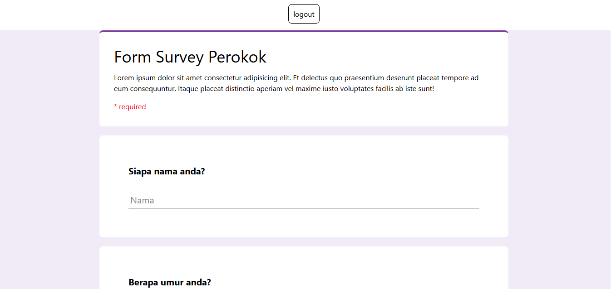
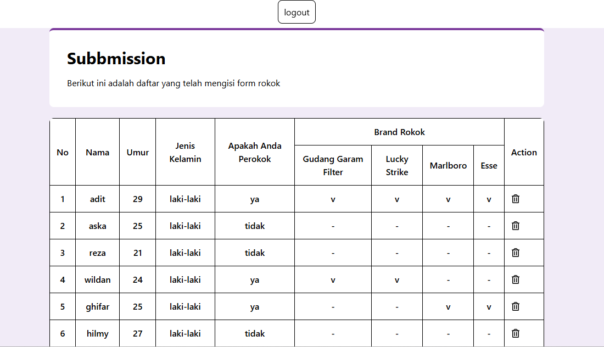
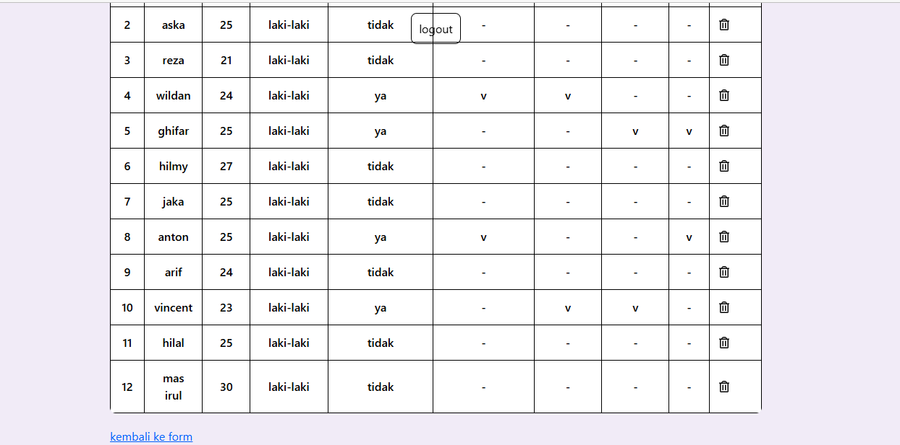

# Aplikasi surfey fomr roko

- Aplikasi **Survey Form Rokok** berbasis **React JS** yang digunakan untuk mengisi dan menampilkan data hasil survei dalam bentuk tabel.

## Teknologin yang digunakan

- React JS
- Tailwind CSS
- Vite
- JavaScript

## feature

- Halaman login menggunakan email dan password dan sudah ada validasi
- Form survey rokok untuk mengisi data dan sudah ada validasi
- Submit data survey ke halaman submission
- Menampilkan hasil survey dalam bentuk tabel
- Data tersusun secara berurutan berdasarkan waktu submit
- Navigasi kembali ke halaman form untuk mengisi data baru

#### screnshoot login

#### screnshoot form

#### screnshoot form

#### screnshoot submission

#### screnshoot submission

## Cara Menajalanakan Aplikasi

- Clone repositori ini
- buka vscode
- buka vscode di terminal dan jalankan npm install
- jalankan progam npm run dev
- terdapat halaman login
- masuk menggunakan akun email dan password dan klik login
- terdapat halaman yang berisi form survey rokok, dan isi nama dan lainnya yang sudah di sediakan
- klik submit, makan akan mengarahkan ke halaman submission dan otomatis hasil dari form survey rokok akan mengisi di dalam tabel
- klik ke halaman kembali ke form untuk mengisi kembali form input survey rokok
- jika sudah terisi maka di halaman submission akan mengisi kembali berdasarkan form yang sudah di submit
- di dalam tabel akan terisi secara urutan
  -selesai
